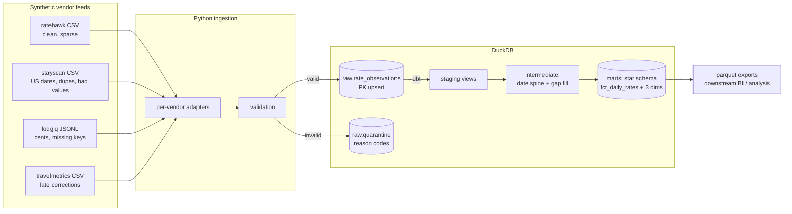

# Hotel Pricing Data Platform

[](https://github.com/nicobeltran7/hotel-pricing-data-platform/actions/workflows/ci.yml)

End-to-end pricing intelligence pipeline: four deliberately messy vendor rate feeds are ingested into DuckDB with upsert-by-natural-key and quarantine handling, then modeled with dbt into a tested star schema with a dense, gap-filled daily rate series.

**Stack:** Python · DuckDB · dbt-core · GitHub Actions

```
make all   # generate -> ingest -> seed -> dbt build -> export
```

## Architecture



## What this demonstrates

| Skill | Where |
|---|---|
| Idempotent upsert by natural key | `src/ingest.py` — `ON CONFLICT DO UPDATE`, corrections overwrite |
| Unresolved-row fallback | `raw.quarantine` with reason codes; nothing silently dropped |
| Multi-source normalization | Per-vendor adapters (renamed columns, US dates, cents, JSONL) |
| Window-function SQL | `int_daily_rates_filled` — date spine, vendor median blend, `LAST_VALUE IGNORE NULLS` forward fill |
| Dimensional modeling | Star schema, integer `yyyymmdd` date keys, conformed dims |
| dbt testing | Schema tests (unique / not_null / relationships / accepted_values), custom generic test, singular gap-fill consistency test |
| Incremental models | `fct_daily_rates` — delete+insert with a 7-day reprocessing window |
| CI | Lint -> pytest -> full pipeline -> `dbt build` -> idempotency proof on every PR |

## Data-defect catalog (all injected on purpose)

| ID | Defect | Vendor | Handled by |
|---|---|---|---|
| G1 | ~30% missing shop days (coverage gaps) | ratehawk | gap-fill in `int_daily_rates_filled`, flagged `is_gap_filled` |
| D1 | Exact duplicate rows | stayscan | in-batch dedupe keep-last + PK upsert |
| U1 | Rates delivered in cents | lodgiq | unit conversion in adapter |
| Q1 | Missing property codes | lodgiq | quarantined `MISSING_PROPERTY` |
| L1 | Corrections re-sent for prior dates | travelmetrics | upsert overwrites; incremental window reprocesses |
| V1 | Negative / zero rates | stayscan | quarantined `NON_POSITIVE_RATE` |
| — | US-format dates, renamed columns | stayscan | adapter normalization; unparseable -> `BAD_DATE` |

The data is fully synthetic and seeded (`--seed 42`): every run reproduces the same files, defects included. See `src/generate_data.py`.

## Design decisions

**Why DuckDB?** Zero-infrastructure analytical database that runs the same locally and in CI. The dbt project would port to Snowflake/Fabric by swapping the profile — the modeling layer is deliberately engine-agnostic (one `generate_series` date spine is the only DuckDB-specific SQL).

**Why upsert instead of append + dedupe downstream?** Vendors re-send corrected rows for prior dates. Upserting on the natural key at the landing zone keeps `raw` trustworthy and makes ingestion idempotent — re-running a file is a no-op, which CI proves on every push.

**Why quarantine instead of dropping bad rows?** Silent drops hide vendor quality regressions. Quarantined rows carry a `reason_code`, so a spike in `MISSING_PROPERTY` from one vendor is a queryable signal, not a mystery.

**Why a vendor median in the blend?** A single vendor drifting (or getting scraped wrong) shouldn't move the blended rate. Median is robust to one bad source among four; `vendor_count` is kept on the fact for confidence weighting downstream.

**Why flag gap-filled rows instead of just filling?** BI consumers need dense daily series, but analysts need to know which values are observations vs. carry-forward. `is_gap_filled` and `days_since_observation` keep the fill honest and testable (see the singular test).

**Why incremental with a 7-day lookback?** Late corrections arrive within a few days. `delete+insert` over a trailing window picks them up without full-refresh cost. The window is a documented trade-off: cheaper than full rebuild, wider than the observed correction latency.

**Why no dbt packages?** The only dbt_utils feature needed was composite-key uniqueness; a 6-line local macro keeps the project dependency-free and the CI supply chain minimal. (Pinned dbt-core 1.x; will evaluate the Fusion-based v2 once it's GA.)

## Repo layout

```
src/                  generator, ingestion, parquet export
tests/                pytest unit tests for validation + upsert semantics
dbt/
  models/staging/       typed views over raw
  models/intermediate/  date spine + gap fill (the interesting SQL)
  models/marts/         star schema
  macros/               custom generic tests
  tests/                singular tests
.github/workflows/    CI pipeline
```

## Running locally

```bash
pip install -e ".[dev]"
make all      # full pipeline; then:
make test     # pytest
make docs     # dbt docs into dbt/target/
```

Marts land in `exports/*.parquet` — consumed by my [Power BI semantic model](https://github.com/nicobeltran7/hotel-ops-semantic-model) project.
