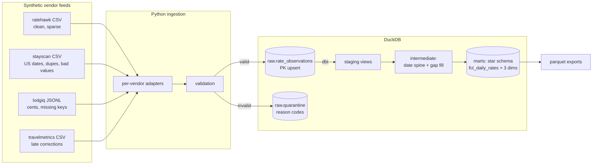

# Hotel Pricing Data Platform

[](https://github.com/nicobeltran7/hotel-pricing-data-platform/actions/workflows/ci.yml)

A pricing data pipeline built with Python, DuckDB and dbt. Four simulated vendor rate feeds (each messy in its own way) get ingested into a raw landing zone, then modeled into a star schema with a dense daily rate series.

I work with multi-source operator data at my day job, and this repo recreates the ingestion and modeling patterns I use there against a synthetic hotel-rates domain. All data is generated by a seeded script in this repo.

## Quickstart

```bash
pip install -e ".[dev]"
make all      # generate -> ingest -> seed -> dbt build -> export
make test     # unit tests for the ingestion layer
make docs     # dbt docs
```

## How it works



Each vendor file goes through an adapter that maps it to a common shape, then a validation step. Valid rows are upserted into `raw.rate_observations` on the natural key (vendor, property, date, duration band), so re-running a file is a no-op and corrected rows overwrite in place. Rows that fail validation land in `raw.quarantine` with a reason code instead of being dropped.

From there dbt takes over: typed staging views, an intermediate model that builds a full date spine per property/band and forward-fills observation gaps with `LAST_VALUE ... IGNORE NULLS`, and a marts layer with integer date keys and an incremental fact table. 25 dbt tests plus a singular test that checks the gap-fill flags are consistent.

## The injected data problems

The generator plants these on purpose (seeded, so every run reproduces them):

| ID | Problem | Vendor | Where it gets handled |
|---|---|---|---|
| G1 | ~30% of shop days missing | ratehawk | forward fill in `int_daily_rates_filled`, flagged `is_gap_filled` |
| D1 | duplicate rows | stayscan | in-batch dedupe + PK upsert |
| U1 | rates sent in cents | lodgiq | unit conversion in the adapter |
| Q1 | missing property codes | lodgiq | quarantine, `MISSING_PROPERTY` |
| L1 | corrections re-sent for old dates | travelmetrics | upsert overwrite + incremental lookback window |
| V1 | negative / zero rates | stayscan | quarantine, `NON_POSITIVE_RATE` |

stayscan also uses MM/DD/YYYY dates and different column names, which the adapter normalizes.

## Design notes

DuckDB because it needs zero infrastructure and behaves the same locally and in CI. The modeling layer barely uses anything DuckDB-specific (one `generate_series` call), so pointing the profile at Snowflake or Fabric would mostly just work.

Upsert-at-landing instead of append-and-dedupe-later: vendors re-send corrected rows for prior dates, and I'd rather have `raw` be trustworthy than reconstruct truth downstream. CI actually re-runs the ingest and asserts row counts don't change.

Quarantine instead of dropping: a spike in `MISSING_PROPERTY` from one vendor is a signal you want to be able to query, not a mystery.

The blend uses a median across vendors rather than a mean, so one vendor drifting doesn't move the number. `vendor_count` stays on the fact for anyone who wants to weight by confidence.

Gap-filled rows are flagged rather than silently filled. BI wants a dense series; analysts need to know which values are real observations. `days_since_observation` tells you how stale a carried-forward value is.

The incremental fact reprocesses a trailing 7-day window on each run, which covers the correction latency I built into the data without paying for a full rebuild.

No dbt packages. The only thing I wanted from dbt_utils was a composite-key uniqueness test and that's a six-line macro. Pinned to dbt-core 1.x for now; I'll look at the Fusion-based 2.x when it's GA.

## Layout

```
src/                  generator, ingestion, parquet export
tests/                pytest for validation + upsert semantics
dbt/
  models/staging/
  models/intermediate/   date spine + gap fill
  models/marts/
  macros/                custom tests
  tests/                 singular tests
.github/workflows/    CI
```

The parquet exports in `exports/` feed my [Power BI semantic model](https://github.com/nicobeltran7/hotel-ops-semantic-model) project.
